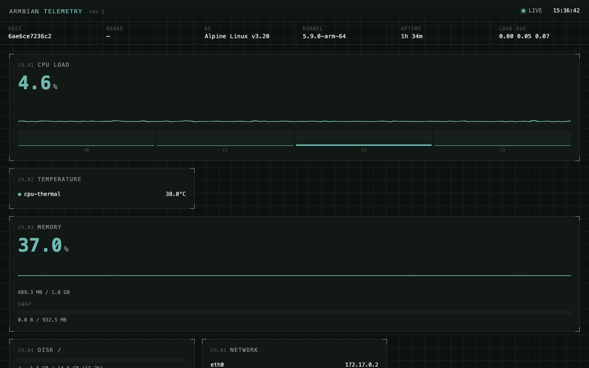

# homelab

Self-contained web dashboard for Armbian / Linux SBCs. Dark instrument-panel style, live-updating stats, zero dependencies.




## Features

- **CPU** — overall load %, per-core bar chart, scrolling trace
- **Temperature** — all thermal zones from `/sys/class/thermal`
- **Memory & Swap** — usage %, scrolling trace, raw amounts
- **Disk** — root partition usage bar
- **Network** — active interfaces with IPv4 addresses
- **Docker** — running containers (name, image, status, ports)
- **System info** — hostname, board model, OS, kernel, uptime, load avg

## Quick start

```sh
go build -o armbian-stats-web .
./armbian-stats-web
```

Open http://localhost:8080.

## Cross-compile for ARM

**64-bit ARM (most modern boards):**
```sh
GOOS=linux GOARCH=arm64 go build -o armbian-stats-web .
```

**32-bit ARMv7 (older boards):**
```sh
GOOS=linux GOARCH=arm GOARM=7 go build -o armbian-stats-web .
```

Copy the binary to the board and run.

## Options

| Flag | Default | Description |
|------|---------|-------------|
| `-addr` | `:8080` | Listen address, e.g. `:9000` or `0.0.0.0:9000` |
| `-interval` | `2` | Poll interval in seconds |

## How it works

A background goroutine reads `/proc` and `/sys` every N seconds. A JSON endpoint (`/api/stats`) serves the latest snapshot. The frontend is a single HTML page with embedded CSS and JS — no frameworks, no CDN, nothing to download.

The entire UI and API are baked into the binary at compile time via `//go:embed`. Deployment is a single file: scp the binary to the board, run it, open a browser.

## Requirements

- Linux with `/proc` and `/sys` (standard on Armbian, Raspbian, Ubuntu Server, etc.)
- Docker CLI optional — container stats are skipped if `docker` is not found
- Go 1.26+ to build (or download a prebuilt binary)
